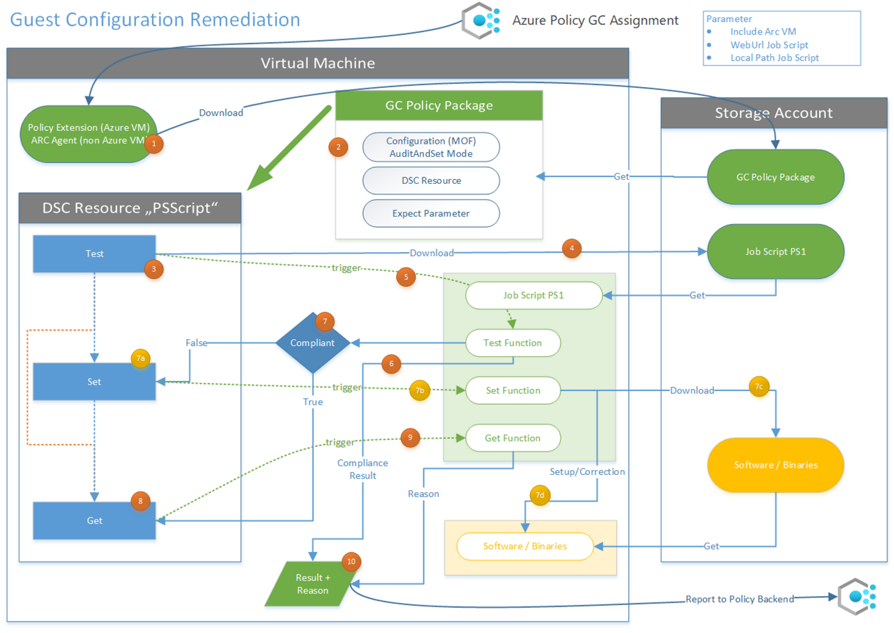

# MachineConfiguration

This solution descripes the steps how to implement an Automanage Machine Configuration (former GuestConfiguration) in order to Audit settings inside a machine and auto correct drifts.
The advantage is in setting up only one policy for each Windows and Linux and provide a jobscript per assignment.

The created policy will be assigned and reports the compliance state back to Azure Policy.
The policy created can be assigned multiple times for different purposes, each assignment is unique as of a different parameter, the jobscript.

**Example:**
- Linux
    - Policy: LinuxGC
    - Assignment
        - Linux-InstallPackage1 (UX-InstallPackage01.ps1 jobscript)
        - Linux-StartService-xxx (UX-StartService-xxx.ps1 jobscript)
        - Linux-EnforceIPtables (UX-EnforceIPtables.ps1 jobscript)
- Windows
    - Policy: WindowsGC
    - Assignment: 
        - Windows-InstallPackage1 (Win-InstallPackage01.ps1 jobscript)
        - Windows-ApplyT0Hardening (Win-ApplyT0Hardening.ps1 jobscript)
        - Windows-AddRegKey-xxx (Win-AddRegKey-xxx.ps1 jobscript)

  https://learn.microsoft.com/en-us/azure/governance/machine-configuration/

 

**Possible use-cases**  
- Audit and/or Correct Files/Content/Registry
- Audit and/or Correct Services/Deamons
- Install Software

**Target**  
- Windows and Linux machines
- Azure and Arc connected machines

**Report and Dashboard**   
- Result visible in Azure Policy
- Policy evaluation via Azure ActivityLogs
- Analyse result in Azure Resource Graph
- recommendations visibile in Microsoft Defender for Cloud

&nbsp;&nbsp;&nbsp;  Workbook analysing the results
  &nbsp;&nbsp;&nbsp;  https://github.com/Azure/Microsoft-Defender-for-Cloud/tree/main/Workbooks/GuestConfiguration%20Result

&nbsp;&nbsp;&nbsp; Workbook Azure Arc for Servers Monitoring
  &nbsp;&nbsp;&nbsp; https://techcommunity.microsoft.com/t5/azure-arc-blog/azure-arc-for-servers-monitoring-workbook/ba-p/3298791
  

**Setup and Verification**   
&nbsp;&nbsp;&nbsp;&nbsp;  _Step 1 [Prepare Environment](./howto/Prepare.md)_  
&nbsp;&nbsp;&nbsp;&nbsp;  _Step 2 [Create Policy](./howto/CreatePolicy.md)_  
&nbsp;&nbsp;&nbsp;&nbsp;  _Step 3 [Create and Store Job Script](./howto/CreateJobScript.md)_  
&nbsp;&nbsp;&nbsp;&nbsp;  _Step 4 [Policy Assignment](./howto/PolicyAssignment.md)_  
&nbsp;&nbsp;&nbsp;&nbsp;  _Step 5 [Check Results](./howto/CheckResult.md)_  

** **
## Solution Flowchart

1. assigned policy downloads the GC policy packages (includes all to do the job)
2. machines extracts the package and execute DSC
3. the "Test" method is triggered
4. the jobscript is downloaded (green box) and stored on a local path, both provided by a parameter
5. the "Test Function" is triggered, returns the result
6. the desired state returns true or false, defines if the policy is Compliant or NonCompliant
7. the "Test" results decides if we trigger the "Set" before the "Get" method
    - a. the "Set" method is triggered
    - b the "Set Function" is triggered 
    - c/d depending how to correct the drift, could be a binary download/setup or start a service
8. the "Get" method is triggered
9. the "Get Function" is triggered, returns the reason why the state is Compliant or NonCompliant
10. Result is reported back to Azure Policy

Writing a custom DSC resource with PowerShell classes
  https://learn.microsoft.com/en-us/powershell/dsc/resources/authoringResourceClass?view=dsc-1.1&viewFallbackFrom=dsc-3.0
