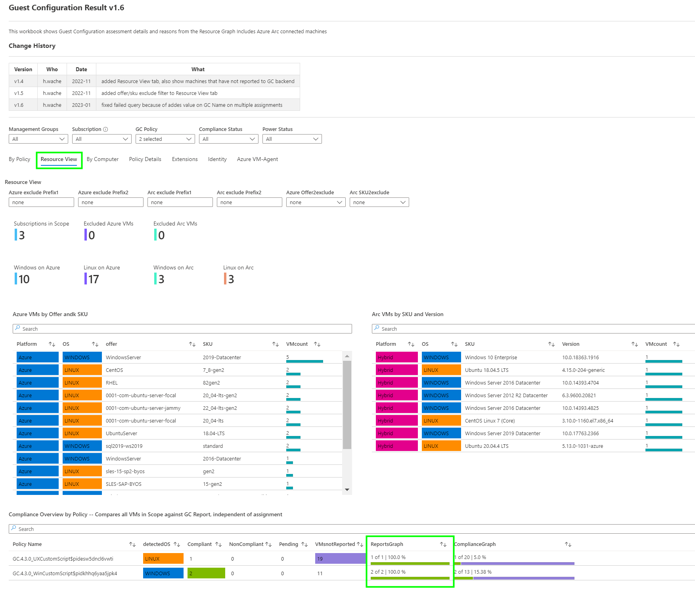

**Steps**   
&nbsp;&nbsp;&nbsp;&nbsp;  _Step 1 [Prepare Environment](./Prepare.md)_  
&nbsp;&nbsp;&nbsp;&nbsp;  _Step 2 [Create Policy](./CreatePolicy.md)_  
&nbsp;&nbsp;&nbsp;&nbsp;  _Step 3 [Create and Store Job Script](./CreateJobScript.md)_  
&nbsp;&nbsp;&nbsp;&nbsp;  _Step 4 [Policy Assignment](./PolicyAssignment.md)_  
&nbsp;&nbsp;&nbsp;&nbsp;  _--> Step 5 [Check Results]_  

***

    

### Check the Result  
There are some ways to check the result
 

Azure Policy -- CLICK ME

  

  Navigate to Azure Policy  

  
    

  ***

  
    

  ***

  
    

  ***

  
   

  This screenshot show that the JobScript cannot be downloaded, in this case due to an expired token     

  ***

  
   

  

Workbook -- CLICK ME

  

    
  I created a Azure Workbook visualizing Guest policies results and much more from data stored in ARG.  
  Focus is on Azure and Arc connected machines   
  _Download the code from MDC GitHub and import it in your Azure environment_  
  _https://github.com/Azure/Microsoft-Defender-for-Cloud/tree/main/Workbooks/GuestConfiguration%20Result_  

  
  
  ***
    
  
    

  ***

  
    

  ***

  
    

  ***

  
    
 
  

Defender for Cloud - GUI -- CLICK ME

  

  
  
  ***

  

  ***

  

  ***

  
  
  

  

Defender for Cloud Recommendation - Azure Resource Graph -- CLICK ME

  

  

  ***

  

  

Defender for Cloud Recommendation - Log Analytics Continuous Export -- CLICK ME

  

    
  You can export recommendation including timestamp of a state change to a Log Analytics workspace or Event Hub.   
  _Continuously export Microsoft Defender for Cloud data_  
  _https://learn.microsoft.com/en-us/azure/defender-for-cloud/continuous-export_  

   

  

Azure Resource Graph -- CLICK ME

  

  
  Navigate to Azure Resource Graph Explorer  
  
  
  
  ***
    
  
    

  

REST API -- CLICK ME

  

    
  _Azure Policy Guest Configuration REST API Reference_  
  _https://learn.microsoft.com/en-us/rest/api/guestconfiguration/_   

  _Microsoft Defender for Cloud_  
  _https://learn.microsoft.com/en-us/rest/api/defenderforcloud/_   

   

  ***

  
    
  

PowerShell -- CLICK ME

  

    
  _PowerShell Az.Resources | Policy_  
  _https://learn.microsoft.com/en-us/powershell/module/az.resources/?view=azps-9.4.0#policy_   

  _PowerShell Az.PolicyInsights | Policy Insights_  
  _https://learn.microsoft.com/en-us/powershell/module/az.policyinsights/?view=azps-9.4.0#policy-insights_   
    
  _PowerShell Az.Security | Security_  
  _https://learn.microsoft.com/en-us/powershell/module/az.security/?view=azps-9.4.0#security_   

   

  ***

  
    
  

