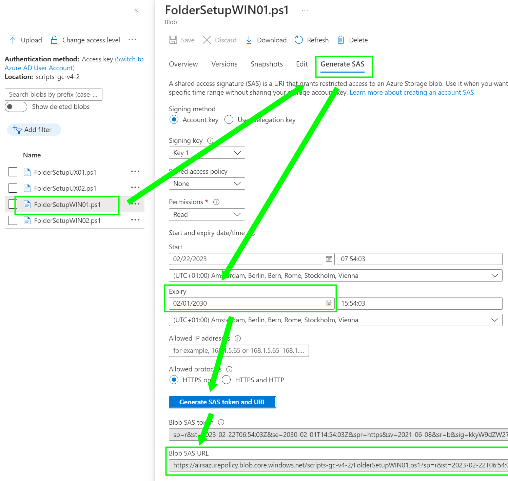

**Steps** <br /> 
&nbsp;&nbsp;&nbsp;&nbsp;  _Step 1 [Prepare Environment](./Prepare.md)_ <br />
&nbsp;&nbsp;&nbsp;&nbsp;  _Step 2 [Create Policy](./CreatePolicy.md)_ <br />
&nbsp;&nbsp;&nbsp;&nbsp;  _--> Step 3 [Create and Store Job Script]_ <br />
&nbsp;&nbsp;&nbsp;&nbsp;  _Step 4 [Policy Assignment](./PolicyAssignment.md)_ <br />
&nbsp;&nbsp;&nbsp;&nbsp;  _Step 5 [Check Results](./CheckResult.md)_ <br />

***

<br />  <br />

### Create and Store a job script <br />
As example, I created two simple jobscripts to audit and create a folder, one for Windows and Linux.
Generally, there are three sections as descript in the design overview

As second step, the scripts are stored in a Azure Storage account
<br />

**JobScript** <br />
 &nbsp;&nbsp;&nbsp;&nbsp; _function_TestScript: the result expects a empty result or $false to be false, any other result is true_ <br />
 &nbsp;&nbsp;&nbsp;&nbsp; _function_GetScript: the result expects a string_ <br />
 &nbsp;&nbsp;&nbsp;&nbsp; _function_SetScript: no result is expected, only provide the remediation logic_ <br />
<br />

Windows
```powershell
function function_TestScript
{
    $result = Test-Path "c:/FolderSetupWIN01"
    return $result
}

function function_GetScript
{
    $folder = "c:/FolderSetupWIN01"
    $foldercheck = Test-Path $folder
    $result = if (Test-Path $folder)
    {
        "Folder {0} is present" -f $folder
    }
    else {
        "Folder {0} is not present" -f $folder
    }
    return $result
}

function function_SetScript
{
    new-item -ItemType Directory -path "c:/FolderSetupWIN01"
}
```
<br />

Linux
```powershell
function function_TestScript
{
    $result = Test-Path "/opt/FolderSetupUX01"
    return $result
}

function function_GetScript
{
    $folder = "/opt/FolderSetupUX01"
    $foldercheck = Test-Path $folder
    $result = if (Test-Path $folder)
    {
        "Folder {0} is present" -f $folder
    }
    else {
        "Folder {0} is not present" -f $folder
    }
    return $result
}

function function_SetScript
{
    new-item -ItemType Directory -path "/opt/FolderSetupUX01"
}
```
<br /><br />

**Store the scripts and create a Blob SAS** <br />
The jobscripts are stored on a Blob container. Navigate to the Azure Portal (or alternatively use the upload function as we've done on the page before already). Create a container for scripts on the Storage account and upload the .ps1 files.
Next, create a SAS token like in the following picture, copy the SAS Url


<br />

Copy the filename and the Blob SAS URL, this is needed for the assignment as parameter


<br /><br /><br />
&nbsp;&nbsp;&nbsp;&nbsp;  _Next: Step 4 [Policy Assignment](./PolicyAssignment.md)_ <br />
