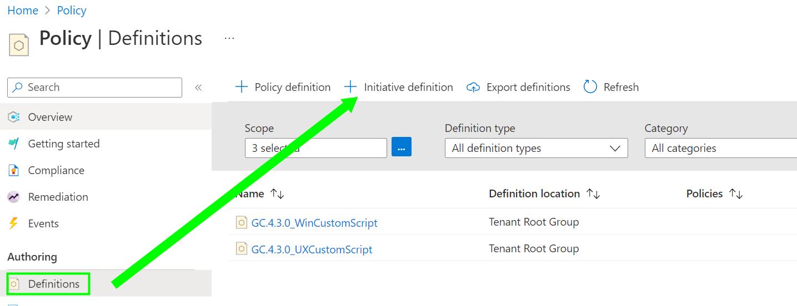

**Steps**   
&nbsp;&nbsp;&nbsp;&nbsp;  _Step 1 [Prepare Environment](./Prepare.md)_  
&nbsp;&nbsp;&nbsp;&nbsp;  _Step 2 [Create Policy](./CreatePolicy.md)_  
&nbsp;&nbsp;&nbsp;&nbsp;  _Step 3 [Create and Store Job Script](./CreateJobScript.md)_  
&nbsp;&nbsp;&nbsp;&nbsp;  _--> Step 4 [Policy Assignment]_  
&nbsp;&nbsp;&nbsp;&nbsp;  _Step 5 [Check Results](./CheckResult.md)_  

***

    

### Azure VM Prerequesites  
as mentioned on the _[Prepare Environment](./Prepare.md)_ site, we need to install the AzurePolicy extension with a managed identity on Azure VMs. You can ignore both settings for Arc machines. Either deploy it manually on each VM, or assign the following built-in policy initiative that is present in the system already.

 **_Deploy prerequisites to enable Guest Configuration policies on virtual machines_**  

   

Verify the extension and managed identity is installed. If the policy is assigned to existing VMs, a remediation is required to deploy the resources. Newly created VMs should get the settings applied by the policy within 15 minutes.

    

### Policy Assignment  
The policy definitions can be assigned directly, but I want the results also visible as Recommendation in _Microsoft Defender for Cloud_. Therefore we need to create an initiative and assign these.
  

**Create Initiative**  

  

***

  

***

  

***

  

***

 

Select Group and Click Save  

***

Set the parameters  
  - Include Arc machines in case you want treat them like Azure VMs  
  - Select the Local path for the jobscript, Default is the Windows version, for Linux adjust it  
  - Local PowerShell Script Name --> put in the ScriptName.ps1  
  - Web PowerShell Script --> put in the SAS URI   

 

***

  

**Assign the Initiative**  
if you don't want the results in Microsoft Defender for Cloud, do the assignment in Azure Policy.  
go to _Microsoft Defender for Cloud_

 

Select the Subscription of MGMT Group where the assignment should be done  

***

  

***

  

***

  

***

 

Change the Identity location if required  
Click Review + create and Create  
 

This needs now some time for the machines to evaluate the policy.  
Currently we have not triggered a remediation, we need the result first. At this moment we're in Audit only mode.  
The assignment gives the possibility to remediate but only a single policy.
New VMs, created after the initiative assignment was done, are remediated automatically.
  

**Trigger a Remediation Task**  
Once the policy has evaluated and finds noncompliant results we can start the remediation  

  

***

  

***
 

**Congratulations, you have done the whole job :relaxed:**  
You have deployed custom Machine Configuration policies and assigned it with a jobscript.  
Now you are ready to extend the solution by simply upload additional jobscripts and assign it with the existing policies.
   
The evaluation and report creation need some time.   
Relax, take your time, fill up your coffee :coffee:   
Don't forget to follow the last link and check your results 

   
&nbsp;&nbsp;&nbsp;&nbsp;  _Step 5 [Check Results](./CheckResult.md)_  
