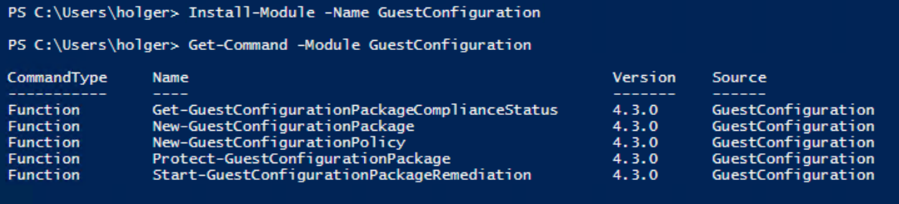
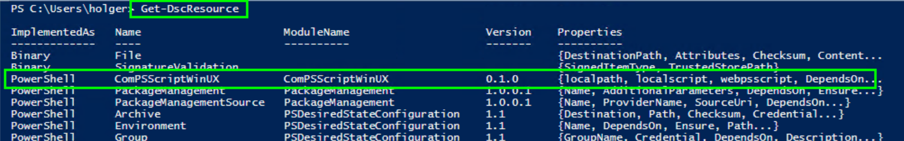

**Steps** <br /> 
&nbsp;&nbsp;&nbsp;&nbsp;  _--> Step 1 [Prepare Environment]_ <br />
&nbsp;&nbsp;&nbsp;&nbsp;  _Step 2 [Create Policy](./CreatePolicy.md)_ <br />
&nbsp;&nbsp;&nbsp;&nbsp;  _Step 3 [Create and Store Job Script](./CreateJobScript.md)_ <br />
&nbsp;&nbsp;&nbsp;&nbsp;  _Step 4 [Policy Assignment](./PolicyAssignment.md)_ <br />
&nbsp;&nbsp;&nbsp;&nbsp;  _Step 5 [Check Results](./CheckResult.md)_ <br />

***

<br />  <br />

### What do we need:
- a Windows Dev machine
- a storage account
- Azure Environment with Arc and/or Azure VMs to verify results

<br /><br />

### Prepare Environment
First an environment is required, where we built the policy packages for both, Windows and Linux. For the building process we use a Windows Server, by now I did setups with Server 2016, 2019 and 2022 -- all are working.
For the basic setup, as descript on the following pages, no more machines are required (Only that one where the policies are finally assigned to verify the functionality).

The generated policy .zip package brings all content and code required to execute the jobscript. The sources (PowerShell and DSC) and logic (how to get and handle the jobscript) is included in the policy package. The jobscript's download location and the location where to store it on the local machine are provided as parameters when the policy is assigned or added to an policy initiative. The jobscript provides the logic and steps how to evaluate a desired state and correct a drift on the target machine. PowerShell code is used on Windows and Linux machines as well. 


<br /><br />

Nevertheless, later on when scripts become more complex, it makes more sense to develop and test jobscripts live on the target systems than wait for Azure Policy to evaluate states and reports it to the backend.


In this case install PowerShell Core on the respective system. <br />
Windows: <br />
https://learn.microsoft.com/en-us/powershell/scripting/install/installing-powershell-on-windows?view=powershell-7.3 <br />
Linux: <br />
https://learn.microsoft.com/en-us/powershell/scripting/install/installing-powershell-on-linux?view=powershell-7.2

<br /><br />


The second part is a location, where the content is stored. This means the policy package, the jobscript and if needed software binaries. Any location is possible, as long as the name resolution works and the client gets a valid certificate on accessing an _https://_ endpoint.
In this example I use Azure Blob storage with SAS tokens. The token will be generated later on, when data is uploaded. For now we need a Storage account with at least one containers.

Create a storage account <br />
https://learn.microsoft.com/en-us/azure/storage/common/storage-account-create?tabs=azure-portal

Quickstart: Upload, download, and list blobs with the Azure portal <br />
https://learn.microsoft.com/en-us/azure/storage/blobs/storage-quickstart-blobs-portal

Grant limited access to Azure Storage resources using shared access signatures (SAS) <br />
https://learn.microsoft.com/en-us/azure/storage/common/storage-sas-overview


<br /><br />


In order machines in Azure are able to recognize assigned Machine Configuration policies and upload a report to Policy backend, they need a small agent. That one is deployed as an VM extension (AzurePolicyforWindows / AzurePolicyforLinux). Additionally, machines need a managed identity. Later, when we assign the policy, we will also do the assignment of built-in policies doing the work on the machines without user interaction. Azure creates the managed identity for Arc machines automatically and does not require the extension, as these is part of the Arc (connected machine) agent.  

Deploy requirements for Azure virtual machines <br />
https://learn.microsoft.com/en-us/azure/governance/machine-configuration/overview#deploy-requirements-for-azure-virtual-machines

<br />
Multiple assignments with different parameters are supported now, therefore we can use same policies not only once. For Windows and Linux different policies are built. Technically they "could" use the same definition, the difference here are the "if" statements inside the policy only. The statement acts as filter according to which configuration attribute a resource is considered and which are out of scope.
<br />
The policy definition is finally created by the GuestConfiguration CmdLet, see below. Depending on the version of the CmdLet and their release dates, different Windows images, Linux distributions, etc. are included in the "if" statement. This can be modified to include official unsupported systems after the definition creation, or when it has been stored in Azure already.  <br />

<br />
Multiple assignments <br /> 

https://learn.microsoft.com/en-us/azure/governance/machine-configuration/overview#multiple-assignments


<br />
Supported Client types: <br /> 

https://learn.microsoft.com/en-us/azure/governance/machine-configuration/overview#supported-client-types


<br /><br />

### Setup on Dev machine

Setup your authoring environment 
<br /> [How to install the machine configuration authoring module | Microsoft Learn](https://learn.microsoft.com/en-us/azure/governance/machine-configuration/machine-configuration-create-setup)

Install PowerShell on Windows
<br /> https://learn.microsoft.com/en-us/powershell/scripting/install/installing-powershell-on-windows?view=powershell-7.3

```powershell
# Install Module
Install-Module -Name GuestConfiguration
```



<br /><br />

I will describe the upload of the policy and package with PowerShell. Therefore, the following CmdLets are required on the Dev machine. You can skip it in case a manual upload is preferred.

```powershell
# Install Module
Install-Module -Name az.accounts    # authentication against Azure
Install-Module -Name az.storage     # upload policy package
Install-Module -Name az.resources   # upload policy
```


<br /><br /><br />
### Install DSC module on Dev machine

Place the DSC module in a PowerShell module folder
e.g. "C:\Program Files\WindowsPowerShell\Modules

_C:\Program Files\WindowsPowerShell\Modules\ComPSScriptWinUX_ 
  - _ComPSScriptWinUX.psd1_ 
  - _ComPSScriptWinUX.psm1_

<details><summary>ComPSScriptWinUX.psd1 -- CLICK ME</summary>
<p>

#### ComPSScriptWinUX.psd1

```powershell
#
# Module manifest for module 'ComPSScript'
#
# Generated by: Holger Wache
#
# Generated on: 02/03/2022
#

@{

    # Script module or binary module file associated with this manifest.
    RootModule = 'ComPSScriptWinUX.psm1'
    
    # Version number of this module.
    ModuleVersion = '0.1.0'
    
    # ID used to uniquely identify this module
    GUID = '2e9859fa-1d2c-484a-bcd7-de9bc4f118d0'
    
    # Author of this module
    Author = 'Holger Wache'
    
    # Company or vendor of this module
    CompanyName = 'Holger Wache'
    
    # Copyright statement for this module
    Copyright = '(c) Holger Wache. All rights reserved.'
    
    # Description of the functionality provided by this module
    Description = 'Trigger external Script for use in Guest Configuration, Windows and Linux supported'
    
    # Minimum version of the Windows PowerShell engine required by this module
    PowerShellVersion = '5.1'
    
    # Functions to export from this module
    FunctionsToExport = @()
    
    # DSC resources to export from this module
    DscResourcesToExport = @()
    
    # Private data to pass to the module specified in RootModule/ModuleToProcess. This may also contain a PSData hashtable with additional module metadata used by PowerShell.
    PrivateData = @{
    
        PSData = @{
    
            # Tags applied to this module. These help with module discovery in online galleries.
            # Tags = @(Power Plan, Energy, Battery)
    
            # A URL to the license for this module.
            # LicenseUri = ''
    
            # A URL to the main website for this project.
            # ProjectUri = ''
    
            # A URL to an icon representing this module.
            # IconUri = ''
    
            # ReleaseNotes of this module
            # ReleaseNotes = ''
    
        } # End of PSData hashtable
    
    } 
}
```
</p>
</details>

<details><summary>ComPSScriptWinUX.psm1 -- CLICK ME</summary>
<p>

#### ComPSScriptWinUX.psm1

```powershell
class Reason {
    [DscProperty()]
    [string] $Code

    [DscProperty()]
    [string] $Phrase
}


function Get-ScriptPath
{
    param(
        [parameter(Mandatory = $true)]
        [ValidateNotNullOrEmpty()]
        [String]$localpath,
        

        [parameter(Mandatory = $true)]
        [ValidateNotNullOrEmpty()]
        [String]$localscript    
    )

      
    # correct problem where Drive "$env" is not found!
    Write-Verbose -Message "localpath is [$localpath]"
    Write-Verbose -Message "localscript is [$localscript]"

    if ($localpath -like "*Env:SystemDrive*")
    {
        $sysdrive = $Env:SystemDrive
        Write-Verbose -Message "systemdrive is [$sysdrive]"

        $localpath = $localpath.Replace($localpath.split("\")[0],$sysdrive) 
        Write-Verbose -Message "changed localpath to [$localpath]"
    }
        
    # define file location
    $psscript = $localpath + $localscript
    Write-Verbose -Message "scriptpath is [$psscript]"          

    $return = @{
        scriptpath = $psscript
        scrptname = $localscript
        scriptdir = $localpath
    }

    return $return
}

[DscResource()]
class ComPSScriptWinUX {
    
    [DscProperty(Key)]
    [string] 
    $webpsscript

    [DscProperty(Mandatory)]
    [string] 
    $localscript

    [DscProperty(Mandatory)]
    [string] 
    $localpath

    [DscProperty(NotConfigurable)]
    [Reason[]] 
    $Reasons


    [ComPSScriptWinUX] Get() {

        $this.reasons = @()
        $reason = $null;

        # call function to get scriptpath
        $psscript = Get-ScriptPath -localpath $this.localpath -localscript $this.localscript

           
        # test script is present
        if (Test-Path $psscript.scriptpath)
        {
            write-verbose -Message "original downloaded script from  [$this.webpsscript]"
            write-verbose -Message "script is correctly stored in [$psscript.scriptpath]"
        } else {
            write-verbose -Message "Error script not stored in [$psscript.scriptpath]"
        }

        # execute script to load functions
        $err = $null
        try 
            {
                .$psscript.scriptpath -ErrorAction SilentlyContinue
                $script = function_GetScript -ErrorAction SilentlyContinue
                write-verbose -Message "Getresult = [$script]"
            } catch {
                $err = "Error loading script or Get Function in {0}" -f $psscript.scriptpath
            }

        Write-Verbose -Message "Script to Get is [$psscript.scriptpath]"
        if ($err) {Write-Verbose -Message "[$err]"}
    
        #Write-Verbose "Use this cmdlet to deliver information about command processing."
        #Write-Debug "Use this cmdlet to write debug information while troubleshooting."

    
        $phrase = $null
        if ($script)  {$phrase = "GetResult: {0}" -f $script}
        else {[string]$phrase = "Error: {0}" -f $err}
    
        $code = "local: {0} | web: {1}" -f $psscript.scriptpath, $this.webpsscript

        # build reason table
        write-verbose -Message "Reason-Code = [$code]"
        write-verbose -Message "Reason-Phrase = [$phrase]"
        $reason = @{
                Code = $code
                Phrase = $phrase
                   }
  
        $this.reasons += $reason
        return @{
            reasons = $this.reasons
            }

        
    }
    
        
    [void] Set() {

        $err = $null

        # call function to get scriptpath
        $psscript = Get-ScriptPath -localpath $this.localpath -localscript $this.localscript
        

        
        # execute script and load functions
        try 
        {
            .$psscript.scriptpath -ErrorAction SilentlyContinue 
            Write-Verbose -Message "Script to Set is [$psscript.scriptpath]"
        
            function_SetScript -ErrorAction SilentlyContinue -wait
            write-verbose -Message "Triggered Set function in [$psscript.scriptpath]"
        } catch {
            $err = "Error loading script or Set Function in {0}" -f $psscript.scriptpath
        }

       if ($err) {Write-Verbose -Message "[$err]"}
    }
    
    
    [bool] Test() {
        
        
         $err = $null

         # call function to get scriptpath
         $psscript = Get-ScriptPath -localpath $this.localpath -localscript $this.localscript

         Write-Verbose -Message "scriptpath is [$psscript.scriptpath]"
 
         
         # download and refresh script from web on every run 
         if (($this.webpsscript -like "https://*") -and ($this.webpsscript -like "*.ps1*")) 
         {
            # remove old content
            if (Test-Path $psscript.scriptpath)
            {
                Remove-Item $psscript.scriptpath
            }

            # create local dir
            if (!(test-path $psscript.scriptdir)) 
            {
                # [System.IO.Directory]::CreateDirectory($directory) | Out-Null
                New-Item -ItemType Directory -Path $psscript.scriptdir | Out-Null
            }
        
            # store content
            Invoke-WebRequest -Uri $this.webpsscript -UseBasicParsing -OutFile $psscript.scriptpath 
            # test job
            if (Test-Path $psscript.scriptpath)
            {
                write-verbose -Message "Downloaded script from  [$this.webpsscript]"
                write-verbose -Message "stored script to [$psscript.scriptpath]"
            } else {
                write-verbose -Message "Error storing webscript to [$psscript.scriptpath]"
            }
        }
    

        # execute script and load functions
         try 
             {
                 .$psscript.scriptpath -ErrorAction SilentlyContinue 
                 Write-Verbose -Message "Script to Test is [$psscript.scriptpath]"
             
                 $script = function_TestScript -ErrorAction SilentlyContinue -wait
                 write-verbose -Message "Testresult = [$script]"
             } catch {
                   $err = "Error loading script or Test Function in {0}" -f $psscript.scriptpath
             }

        if ($err) {Write-Verbose -Message "[$err]"}
    
    
        #Write-Verbose "Use this cmdlet to deliver information about command processing."
        #Write-Debug "Use this cmdlet to write debug information while troubleshooting."

            if (!($script))
            {
                Write-Verbose -Message "[now in False]"
                $result = $false
            }
            else 
            {
                Write-Verbose -Message "[now in True]"
                $result = $true
            }
    
        $type = $result.GetType().name
        Write-Verbose -Message "result is [$type]"
    
        return [bool]$result

    }

}
```
</p>
</details>

<br />

**Verify DSC Resource**


<br /><br /><br />
&nbsp;&nbsp;&nbsp;&nbsp;  Next: _Step 2 [Create Policy](./CreatePolicy.md)_ <br />

